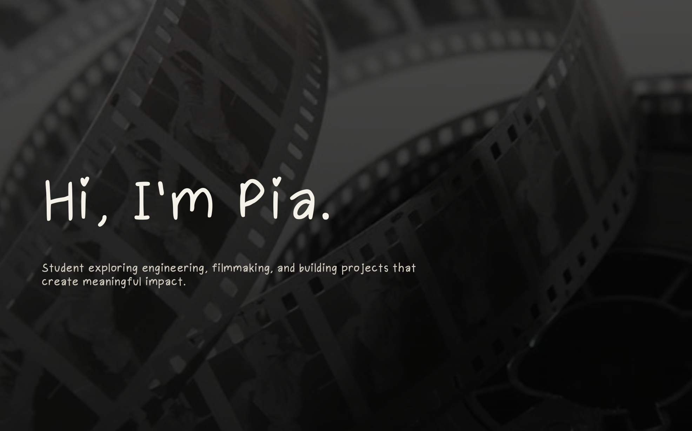

# Pia's Portfolio

A personal portfolio website showcasing my work, specifically, film.

<p align="center">
  
</p>


## Try It
Demo: https://pia-png.github.io/pia-portfolio/

## About

This website is a place to share my projects, interests, and experiences as a high school student passionate about combining technology, creativity, and community impact.

Here you'll find:
- Film projects and documentaries
- Engineering and robotics
- Personal interests and hobbies
- Contact information

---

## Features

- Film portfolio aesthetic
- Interactive hover animations
- Film project gallery with clickable video links
- Custom typography

---

## Built With

- HTML
- CSS

---

## Project Structure

```
.
├── index.html
├── style.css
├── script.js
├── font/
│   └── Pia_font-Regular.otf
└── images/
    ├── background.jpg
    ├── cover1.png
    └── cover2.png
```

---

## Future Plans

- Add scroll reveal animations
- Add cinematic film grain overlay
- Expand film project gallery
- Add photography section
- Add awards and achievements
- Include project filtering
- Add a contact form
